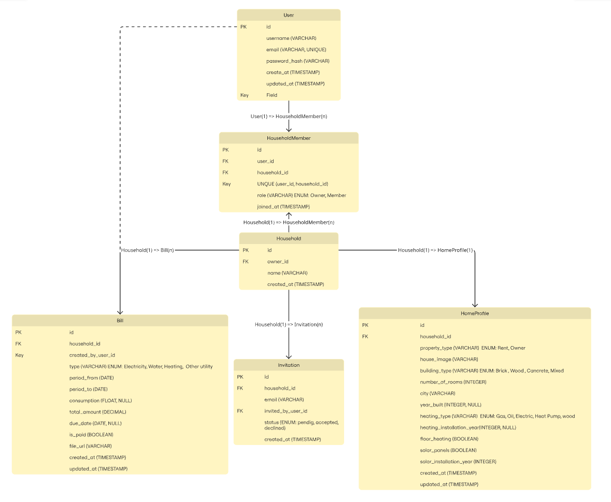
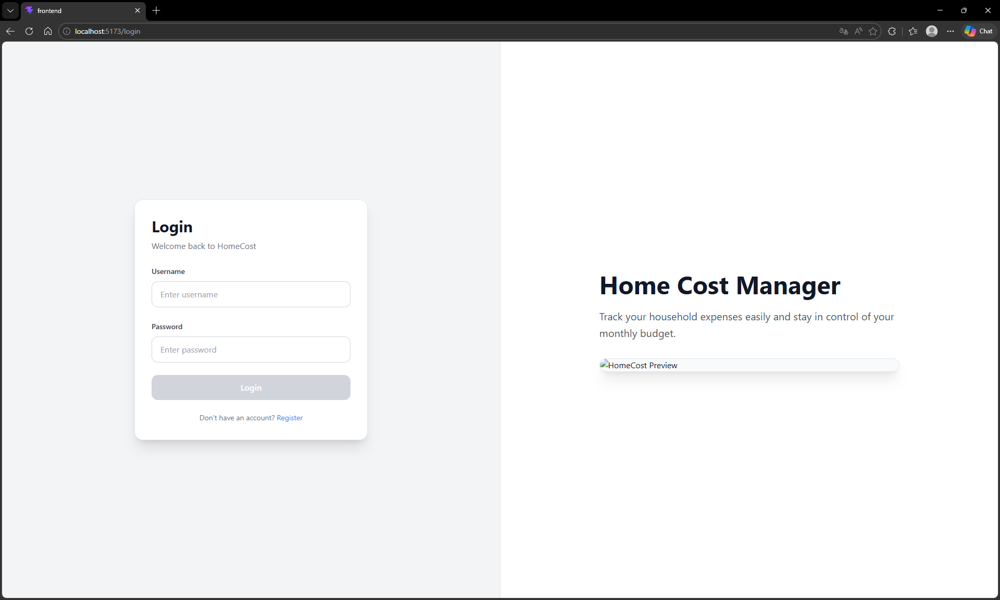
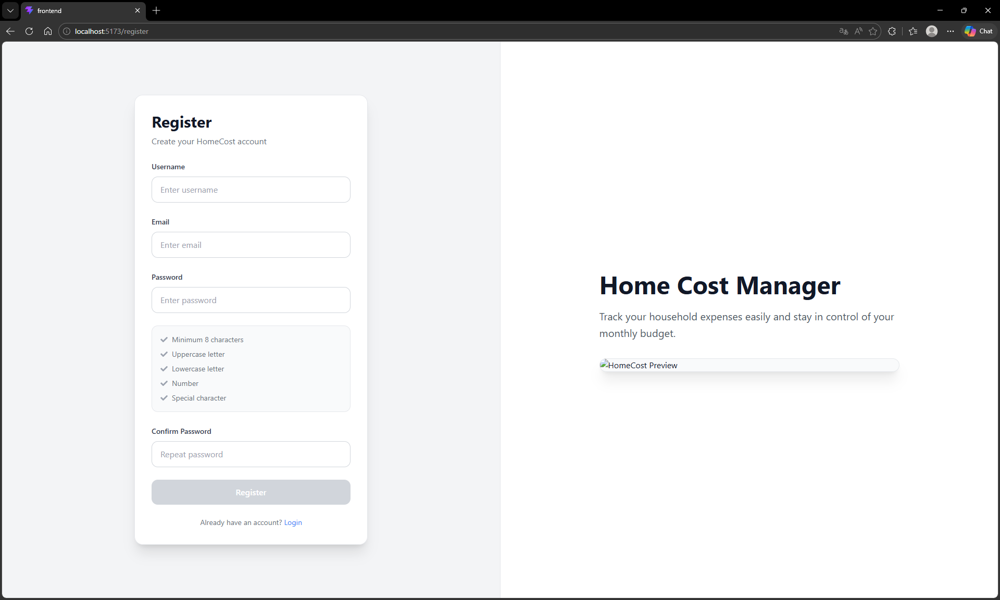
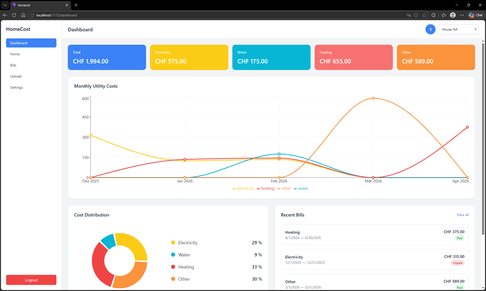
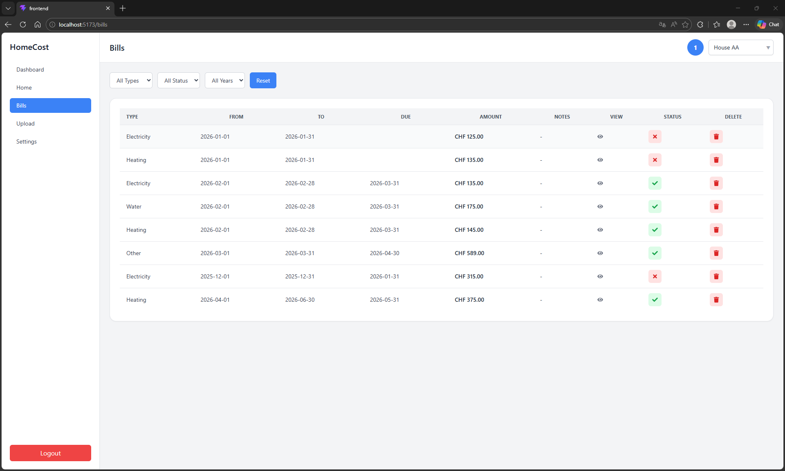
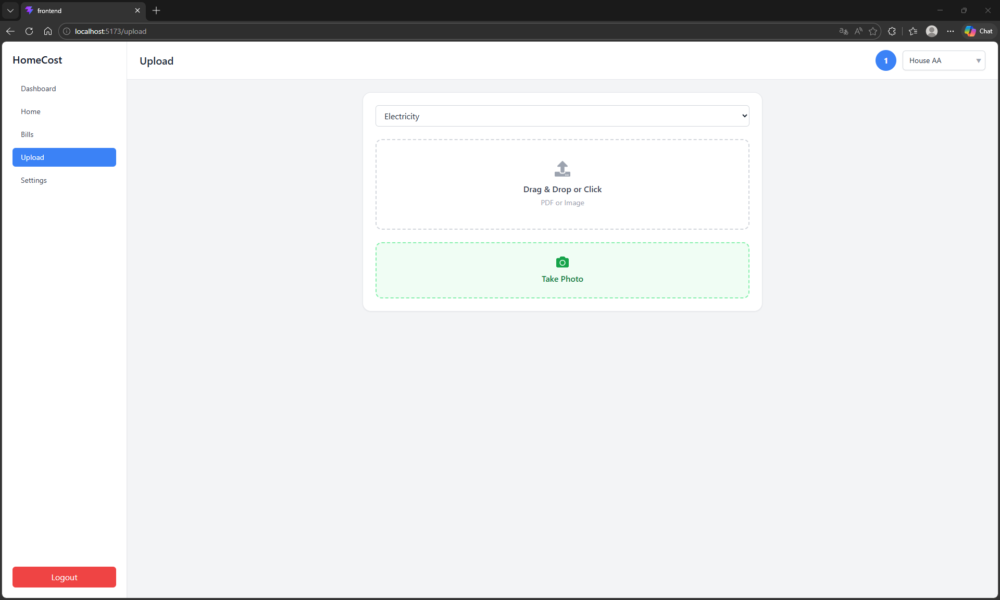
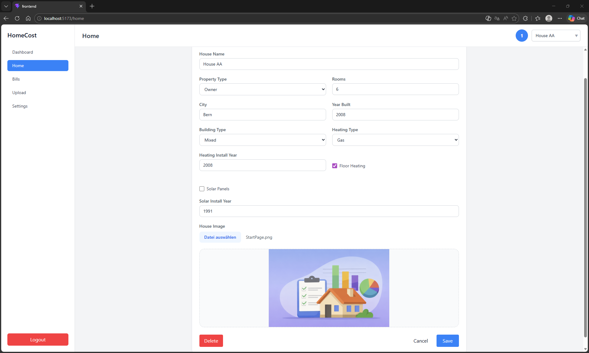

# 🏠 HomeCostManager

Semester Project – CAS Full Stack Development FS26

HomeCostManager is a full-stack web application for managing household expenses. Users can upload utility bills and automatically extract relevant information using OCR technology.

---

# 🎯 Project Goal

The goal of this project was to develop a modern web application for managing household costs.

The application should:

- Manage utility bills centrally
- Support multiple households
- Allow user invitations and collaboration
- Automatically extract bill data using OCR
- Provide a responsive user interface
- Offer secure authentication and authorization

---

# ✨ Features

## User Management

- User registration
- Login & logout
- JWT authentication
- Protected API endpoints

## Household Management

- Create households
- Edit households
- Invite members
- Multi-household support

## Home Profile

- Property information
- Building type
- Heating type
- Number of rooms
- Solar panel information

## Bill Management

- Upload PDF and image bills
- Edit bills
- Delete bills
- Mark bills as paid
- Filter by type, status and year

## OCR Extraction

Automatic extraction of:

- Amount
- Consumption
- Due date
- Billing period
- Bill type

Supported bill types:

- Electricity
- Water
- Heating

---

# 🏗️ Architecture

## Frontend

- React
- Vite
- Tailwind CSS
- React Router

## Backend

- Django
- Django REST Framework
- JWT Authentication

## Database

- SQLite
- PostgreSQL (prepared via environment variables)

## External Services

- OCR.space API
- Tesseract OCR Fallback

---

# 📊 Data Model

The central entity is the household.

A household contains:

- Members
- Bills
- Invitations
- Home Profile

Users and households are connected through a many-to-many relationship using the `HouseholdMember` model.

---

# ⚙️ Installation

## Requirements

- Python >= 3.10
- Node.js >= 18

Required ports:

- Backend: 8000
- Frontend: 5173

---

## Backend Setup

```bash
cd core

python -m venv venv

# Windows
venv\Scripts\activate

# Linux / macOS
source venv/bin/activate

pip install -r ../requirements.txt

python manage.py migrate

python manage.py runserver
```

Backend URL:

```text
http://127.0.0.1:8000
```

---

## Frontend Setup

```bash
cd frontend

npm install

npm run dev
```

Frontend URL:

```text
http://localhost:5173
```

---

# 🔐 Environment Variables

Create:

```text
core/.env
```

Example:

```env
SECRET_KEY=your-secret-key

DEBUG=True

OCR_API_KEY=your-ocr-api-key

USE_POSTGRES=False

DB_NAME=homecostmanager
DB_USER=postgres
DB_PASSWORD=postgres
DB_HOST=localhost
DB_PORT=5432
```

> The OCR API key is not included in the repository and must be provided separately.

---

# 🔍 OCR Workflow

1. User uploads a bill
2. React sends the file to Django
3. OCR.space processes the file
4. The parser extracts structured information
5. The form is automatically populated
6. User reviews the data
7. Bill is saved

## OCR Fallback

If OCR.space is unavailable:

```text
OCR.space
    ↓
Error
    ↓
Tesseract
    ↓
Parser
    ↓
Form
```

---

# 🧪 Testing

Implemented tests include:

- Authentication tests
- Bill creation tests
- Bill list tests
- OCR extraction tests
- OCR exception handling tests

External OCR calls are mocked to ensure reliable and reproducible tests.

---

# 📁 Project Structure

```text
core/
├── bills/
├── households/
├── services/
├── users/
├── common/
└── core/

frontend/
├── src/
│   ├── features/
│   ├── services/
│   ├── shared/
│   └── layouts/
```

---

# 🔗 API Endpoints

| Endpoint            | Method  | Description      |
| ------------------- | ------- | ---------------- |
| /api/households/    | GET     | Get households   |
| /api/households/    | POST    | Create household |
| /api/home-profile/  | GET/PUT | Home profile     |
| /api/bills/         | GET     | Get bills        |
| /api/bills/         | POST    | Create bill      |
| /api/bills/extract/ | POST    | OCR extraction   |

---

# 📸 Screenshots

## ERD



## Login



## Register



## Dashboard



## Bills



## Upload Bill



## Home Profile



---

# ⚠️ Known Limitations

- OCR quality depends on bill quality
- OCR.space requires an internet connection
- Not every bill template can be recognized perfectly

---

# 🚀 Future Work

- Advanced OCR recognition
- Cost analytics and statistics
- PDF export
- Excel export
- Bill payment reminders

---

# 👨‍💻 Author

**Ashok Nadesu**

CAS Full Stack Development FS26
